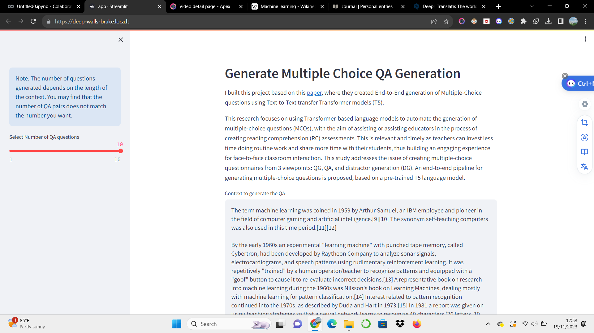
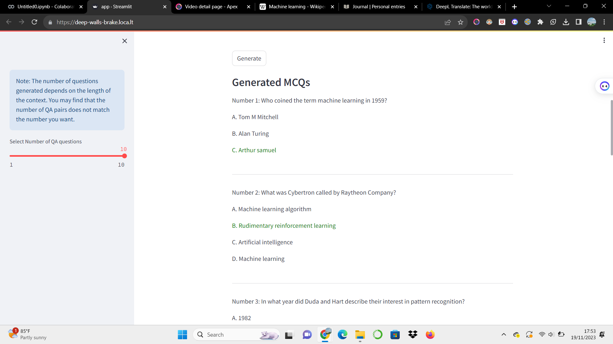

# MCQs

**Note**:I built this project based on this [paper](https://www.sciencedirect.com/science/article/pii/S0957417422014014#s0015)
## Overview
This research focuses on automating the generation of multiple-choice questions (MCQs) using Transformer-based language models. The primary goal is to support educators in the reading comprehension (RC) assessment process, with the expectation of reducing their routine workload. This approach allows teachers to dedicate more time to direct interaction with students during face-to-face classes. The study tackles the challenge of multiple-choice questionnaire generation from three key perspectives: Question Generation (QG), Question Answering (QA), and Distractor Generation (DG). The proposed end-to-end pipeline utilizes a pre-trained T5 language model tailored for QG and QA tasks. Additionally, a smaller version of the T5 model with 60 million parameters is adapted for the DG task. The formulation of the distractor generation problem involves the Text-To-Text approach, training the T5 model on the "generate distractor" task. This task incorporates inputs such as the question, correct answer, and context text to produce the corresponding outlier text. As a complement, a demo web application are developed to visualize the generated multiple-choice questions, enhancing interactive material comprehension for both educators and students.

## Pipeline
This proposal is a sequential processing based on T5 language model to generate multiple choice questions from paragraphs. This pipeline consists of four processes or steps namely input context, generate QA, generate Distractor and prepare questionare. for now I am ignoring the compute similarity pipeline as the model still performs below standard

### Pipeline QA
When the user provides the context and the number of questions to be created, it will automatically divide the context according to the desired number. To generate QA pairs, a model called QAPModel (Question/Answer Pairs Model) is used. When training the model, a special token `sep` is used to separate the parts to be predicted and a token `MASK` is used instead of the target answer when we do not want to perform question generation that considers the answer. In other words, the `sep` token is used as a separator between answer and context, while the `MASK` token is used as a representation of the answer to be changed or hidden. you can see it on the [notebook](https://github.com/fahmiaziz98/multiple_choice_question/blob/main/notebook/T5_MultiTask_QA_Generation.ipynb)

### Pipeline Distractor
DGModel incrementally takes each question and correct answer pair from the previous step and together with the paragraph (context information), generates a list of incorrect answers (distractors). For this task, a model called DGModel is proposed, which is based on a single T5 language model, customised to convert correct answers into incorrect answers by using the question and its associated context.

One of the challenges in training a distractor generation model is the data set to be used, for this purpose, I used DG-RACE, on the data we tried to make three incorrect columns into one by the addition of the token `sep` as a separator so that the model generates 3 distractors but during the fine tuning process the model performed poorly and in the end I chose only one distractor. 

## Result
I created a simple user interface using streamlit where the user just enters context information and specifies how many questions to create.

**Note**: although this project is far from perfect, I feel very satisfied with my own work and thank you for visiting my repo.
